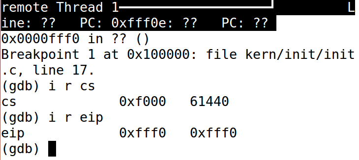
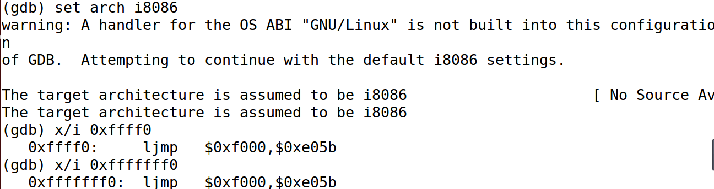
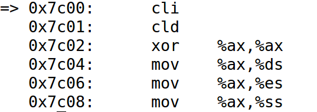
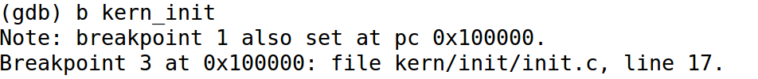
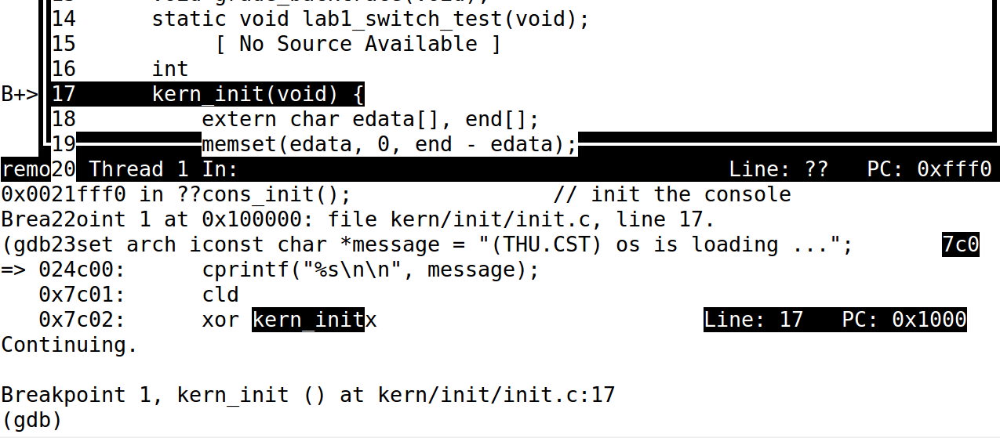

## Lab 1  实验报告

## 练习1：理解通过make生成执行文件的过程

#### 1.操作系统镜像文件ucore.img是如何一步一步生成的？(需要比较详细地解释Makefile中每
#### 一条相关命令和命令参数的含义，以及说明命令导致的结果)

在Makefile中ucore.img生成的关键代码（line 178）为：

```makefile
# create ucore.img
UCOREIMG	:= $(call totarget,ucore.img)

$(UCOREIMG): $(kernel) $(bootblock)
$(V)dd if=/dev/zero of=$@ count=10000
$(V)dd if=$(bootblock) of=$@ conv=notrunc
$(V)dd if=$(kernel) of=$@ seek=1 conv=notrunc

$(call create_target,ucore.img)
```

下依序解释代码含义。

- line1

  ​	在第一句` UCOREIMG	:= $(call totarget,ucore.img)` 中，以$totarget$为变量、$ucore.img$为参数（字符串常量），调用makefile的$call$函数语句赋值给UCOREIMG。

  ​	展开Makefile的line 87(` include tools/function.mk`) ，得到$totarget$的定义：` totarget = $(addprefix $(BINDIR)$(SLASH),$(1)) `

  ​	展开变量，$totarget$的等价定义为：` totarget = $(addprefix $(BINDIR)$(SLASH),$(1)) `

  ​	其中$(1)表示函数的第一个参数，变量$totarget$意为$1中全部内容加上$bin/$前缀。

  ​	综上，第一句含义为`UCOREIMG := bin/ucore.img` 。

- line2

  ​	` $(UCOREIMG): $(kernel) $(bootblock)` 一句表明UCOREIMG需$$(kernel)$与$$(bootblock)$作为依赖项。下面解释这两个依赖项。

  - $$(kernel)$:(line 140)

    ​	

    ```makefile
    kernel = $(call totarget,kernel)
    
    $(kernel): tools/kernel.ld
    
    $(kernel): $(KOBJS)
    @echo + ld $@
    $(V)$(LD) $(LDFLAGS) -T tools/kernel.ld -o $@ $(KOBJS)
    @$(OBJDUMP) -S $@ > $(call asmfile,kernel)
    @$(OBJDUMP) -t $@ | $(SED) '1,/SYMBOL TABLE/d; s/ .* / /; /^$$/d' > $(call symfile,kernel)
    ```

    ​	由 `UCOREIMG	:= $(call totarget,ucore.img)` 中的分析可知， `kernel = $(call totarget,kernel)` 意即 `kernel = bin/kernel` 。` $(kernel): tools/kernel.ld` 一句表明 $$(kernel)$需要依赖$tools/kernel.ld$。

    ​	` $(kernel): $(KOBJS)` 表示$$(kernel)需要$(KOBJS)$作为依赖项，而$(KOBJS)$的定义为 ` KOBJS	= $(call read_packet,kernel libs)` ，其中$(kernel)$与$(libs)$为两个字符串常量，$(read_packet)$为调用的变量，其定义为` read_packet = $(foreach p,$(call packetname,$(1)),$($(p)))`，同line1中的$totarget$它的定义也位于$tools/function.mk$中。

    ​	$(packetname)$的定义为` packetname = $(if $(1),$(addprefix $(OBJPREFIX),$(1)),$(OBJPREFIX))`,在KOBJS执行过程中，将$(kernel)$与$(libs)$传入，并将最终结果以空格为间隔拼接。因此，KOBJS最终表示的是在$kernel$和$libs$文件夹下生成的$.o$文件的所有路径，以空格分隔开。在$$(kernel)$的command代码区中，$@表示对目标集合依次取出执行.

    ​	` @echo + ld $@` 表示在屏幕上显示字符串“+ ld bin/kernel”。

    ​	` $(V)$(LD) $(LDFLAGS) -T tools/kernel.ld -o $@ $(KOBJS)`中，ld命令表示进行连接，- T指定了链接脚本，-o表示输出文件，$(KOBJS)是被链接的文件。在虚拟机中$(LDFLAGS)的定义为` LDFLAGS = -m  elf_i386 -nostdlib`，` -m  elf_i386 -nostdlib `表示生成elf_i386格式的文件；-nostdlib表示仅搜索那些在命令行上显式指定的库路径。

    ​	` @$(OBJDUMP) -S bin/kernel > $(call asmfile,kernel)` ，通过call$asmfile$参数可将传入字符串转化为$.asm$（加上.asm后缀），故` $(call asmfile,kernel) = obj/kernel.asm`, 该行的等价表述为` @$(OBJDUMP) -S bin/kernel > obj/kernel.asm` ， 即执行objdump将上一步链接得到的二进制文件反汇编，-S表示反汇编代码与源码交替显示，输出到` obj/kernel.asm`中。

    ​	` @$(OBJDUMP) -t $@ | $(SED) '1,/SYMBOL TABLE/d; s/ .* / /; /^$$/d' > $(call symfile,kernel)`中，类似$asmfile$，$symfile$表示将传入字符串转化为$.sym$（加上.sym后缀），即`$(call symfile,kernel) = obj/kernel.sym` 。该句的等价表述为` @$(OBJDUMP) -t bin/kernel | sed '1,/SYMBOL TABLE/d; s/ .* / /; /^$$/d' > obj/kernel.sym` ，执行objdump命令，-t命令为显示bin/kernel文件的符号表列表，并将该输出作为下条命令的输入；sed命令表示将第一行到SYMBOL TABLE所在的行都删除，接着将每行所有“空格+字符+空格”替换为空格；接着删除所有的空行。最终将输出保存到obj/kernel.sym中表示kernel的符号表。

  - $$(bootblock)$：(line 159)

    ```makefile
    bootblock = $(call totarget,bootblock)
    
    $(bootblock): $(call toobj,$(bootfiles)) | $(call totarget,sign)
    @echo + ld $@
    $(V)$(LD) $(LDFLAGS) -N -e start -Ttext 0x7C00 $^ -o $(call toobj,bootblock)
    @$(OBJDUMP) -S $(call objfile,bootblock) > $(call asmfile,bootblock)
    @$(OBJCOPY) -S -O binary $(call objfile,bootblock) $(call outfile,bootblock)
    @$(call totarget,sign) $(call outfile,bootblock) $(bootblock)
    ```

    ​	` bootblock = $(call totarget,bootblock) ` 等价于` bootblock = bin/bootblock`。

    ​	` $(bootblock): $(call toobj,$(bootfiles)) | $(call totarget,sign)` 等价于` bin/bootblock: obj/boot/bootasm.o obj/boot/bootmain.o | bin/sign`。

    ​	` @echo + ld $@` 表示在屏幕上显示“+ ld bin/bootblock”。

    ​	` $(V)$(LD) $(LDFLAGS) -N -e start -Ttext 0x7C00 $^ -o $(call toobj,bootblock)`等价于 `$(V)$(LD) $(LDFLAGS) -N -e start -Ttext 0x7C00 $^ -o obj/bootblock.o`，其中ld命令、$(LDFLAGS)均与$$(kernel)$中含义相同，-N表示text和data节设置为可读写；` -e start`表示将start部分作为程序入口；` -TText 0x7C00`表示代码段的起始地址start为0x7C00，$^表示依赖项，即` obj/boot/bootasm.o obj/boot/bootmain.o `，-o与$(toobj)$表示输出文件为obj/bootblock.o；

    ​	` @$(OBJDUMP) -S $(call objfile,bootblock) > $(call asmfile,bootblock)`的等价表述为 ` @$(OBJDUMP) -S obj/bootblock.o > obj/bootblock.asm`， 执行objdump命令，将上一步链接得到的二进制文件obj/bootblock.o反汇编，-S表示反汇编代码与源码交替显示，输出到` obj/bootblock.asm`中。

    ​	` @$(OBJCOPY) -S -O binary $(call objfile,bootblock) $(call outfile,bootblock)` 的等价表述为 ` @$(OBJCOPY) -S -O binary obj/bootblock.o obj/bootblock.out`，-S表示移除标志与重定位信息，-O binary命令表示生成二进制文件。执行objcopy命令，将` obj/bootblock.o`中的代码段拷贝到` bootblock.out`中。

    ​	` @$(call totarget,sign) $(call outfile,bootblock) $(bootblock)` 的等价表述为 ` @bin/sign obj/bootblock.out bin/bootblock`。本句表示执行bin/sign文件，输入为obj/bootblock.out，输出为bin/bootblock。其中bin/sign为依赖项。这个文件的主要作用是检查input文件大小是否合法，并将input文件加上校验位输出到output文件中。

- line3(command部分)

  ` $(V)dd if=/dev/zero of=$@ count=10000`表示创建一大小为10000block的全零文件bin/ucore.img

  ` $(V)dd if=bin/bootblock of=$@ conv=notrunc`表示将bin/bootblock文件拷贝到bin/ucore.img中，` conv=notrunc `意为不截短地拷贝，即把bin/ucore.img中最前面的字节拷贝为bin/bootblock，而后面的零依然保留.

  ` $(V)dd if=bin/kernel of=$@ seek=1 conv=notrunc`表示将bin/kernel不截短地拷贝到bin/ucore.img，` seek=1 `表示从开头跳过1个block再开始拷贝。

- 小结

  综上，ucore.img的主要生成过程为：

  1.编译源码并生成对应的.o文件。

  2.生成内核文件bin/kernel（这一过程包含链接、反汇编、符号表处理操作）。

  3.生成bootloader文件bin/bootblock（这一过程包含拷贝、检查等操作）。

  4.最终生成ucore.img。

#### 2.一个被系统认为是符合规范的硬盘主引导扇区的特征是什么？

 - 大小为512字节。主引导扇区中由源代码生成的文件的大小不超过510字节。
 - 最后两个字节为0x55AA。

## 练习2：使用qemu执行并调试lab1中的软件

#### 1.从CPU加电后执行的第一条指令开始，单步跟踪BIOS的执行。

​	删除tools/gdbinit中的continue指令，执行` make debug`命令后得到如下效果：

.PNG)

​	分别执行`i r cs` 与` i r eip`指令，分别得到寄存器cs与eip中的值分别为` 0xf000 `与` 0xfff0`，如下图所示：



​	在8086机器上，起始指令位置为`cs<<4 + eip = 0xffff0`。而在80386以后的机器中，起始地址为`0xfffffff0`。BIOS实例存储在`cs:ip`为`0xf000:0xe05b`的位置，执行si命令即可对BIOS进行单步追踪。

​	执行`set arch i8086`命令使得gdb运行在16位模式下，`0xffff0`和`0xfffffff0`的地址寻址请求都会被映射到BIOS中的同一个位置，查看这两个地址中的指令，发现符合预期。



#### 2.在初始化位置0x7c00设置实地址断点,测试断点正常。

​	执行` b* 0x7c00`命令，得到如下图所示结果。执行` c`命令，gdb正常输出`Continuing`，可知断点正常。


#### 3.从0x7c00开始跟踪代码运行,将单步跟踪反汇编得到的代码与bootasm.S和bootblock.asm进行比较。

​	执行`x/6i $pc`命令，从上一问的断点处开始单步跟踪，其中`x/6i`表示一次执行6条命令，得到如下所示的结果：



​	由练习一结果，bootblock.asm是由编译+反汇编生成的，其中源码与反汇编代码交替出现，而在bootasm.S中是源码，gdb查看的也是反汇编代码。故两者异同在于：

 - bootblock.asm以`0x7C00`为主引导程序的入口地址，代码与`bootasm.S`一致；且两者的源码均为32位的汇编代码；

 - gdb查看的反汇编代码和bootblock.asm中的反汇编代码是通过机器码生成的反汇编代码。其中gdb中由于执行了set arch i8086，其中的代码既有16位汇编也有32位汇编；而bootblock.asm中的反汇编代码为32位汇编指令。

   可使用`ni`命令进行单步调试。

#### 4.自己找一个bootloader或内核中的代码位置，设置断点并进行测试。

​	执行`b* kern_init`命令，在`kern_init`函数处设置断点，得到结果如下图，可知断点正常：






## 练习3. 分析bootloader进入保护模式的过程

#### 1.为何开启A20，以及如何开启A20？

 - A20是第21条地址线。实模式下最大寻址空间为`0xffff0 + 0xffff`，超出了1MB的空间。在8086机器中只有20根地址线，可以自动取模回卷。但在80286及以后的机器上，地址线多于20根，实模式下最大的地址超过1MB空间，需要在实模式下关闭A20模拟“回卷”操作。开启A20保证从实模式进入保护模式时系统可以访问全部的4GB内存。
 - 控制A20的方式是将A20与键盘控制器8042的一个管脚进行与操作，因此只需要将键盘控制器的这个管脚中恒定输出1即可。但考虑到8042缓冲区中可能存留数据，故需要禁止键盘操作并等待缓冲区中没有数据时再进行操作。

#### 2.如何初始化GDT表？

- 在bootasm.S中，通过使用lgdt指令加载GDT表。相关代码如下：

  ```assembly
  lgdt gdtdesc
  
  /* Normal segment */
  #define SEG_NULLASM                                             \
      .word 0, 0;                                                 \
      .byte 0, 0, 0, 0
  
  #define SEG_ASM(type,base,lim)                                  \
      .word (((lim) >> 12) & 0xffff), ((base) & 0xffff);          \
      .byte (((base) >> 16) & 0xff), (0x90 | (type)),             \
          (0xC0 | (((lim) >> 28) & 0xf)), (((base) >> 24) & 0xff)
  
  /* Application segment type bits */
  #define STA_X       0x8     // Executable segment
  #define STA_E       0x4     // Expand down (non-executable segments)
  #define STA_C       0x4     // Conforming code segment (executable only)
  #define STA_W       0x2     // Writeable (non-executable segments)
  #define STA_R       0x2     // Readable (executable segments)
  #define STA_A       0x1     // Accessed
  
  # Bootstrap GDT
  .p2align 2                                          # GDT要求四字节对齐
  gdt:
      SEG_NULLASM                                     # null seg
      SEG_ASM(STA_X|STA_R, 0x0, 0xffffffff)           # code seg for bootloader and kernel
      SEG_ASM(STA_W, 0x0, 0xffffffff)                 # data seg for bootloader and kernel
  
  gdtdesc:
      .word 0x17                                      # sizeof(gdt) - 1
      .long gdt                                       # address gdt
  ```

  ​	gdtdesc的前两个字节`0x17`表示GDT表共24个字节，3个段。`.long gdt`这四个字节表示GDT表的地址。在GDT表中，三个段分别为空段、bootloader和kernel的代码段、bootloader和kernel的数据段。

#### 3.如何使能，如何进入保护模式？

 - 加载GDT；
 - 取出CR0寄存器，然后将其与0x1进行或操作；
 - 执行32位指令` ljmp $PROT_MODE_CSEG, $protcseg`。此时CS寄存器被设置为代码段选择子$PROT_MODE_CSEG，进入32位保护模式。在protcseg中，设置了数据选择子并将各个段寄存器初始化为内核数据选择子。然后初始化ebp为0，esp为start（即0x7C00)。最后调用bootmain，执行bootloader的主要代码。

## 练习4. 分析bootloader加载ELF格式的OS的过程 

#### 1. bootloader如何读取硬盘扇区的？

 - 等待磁盘就绪，向硬盘0x1F2写入要读取的扇区数。
 - 将要读的扇区号写入硬盘相应的寄存器。
 - 发出读取扇区的命令。
 - 等待硬盘读取完后读取硬盘。

#### 2.bootloader是如何加载ELF格式的OS？

​	加载函数如下：

```c
/* *
 * readseg - read @count bytes at @offset from kernel into virtual address @va,
 * might copy more than asked.
 * */
static void
readseg(uintptr_t va, uint32_t count, uint32_t offset) {
    uintptr_t end_va = va + count;

    // round down to sector boundary
    va -= offset % SECTSIZE;

    // translate from bytes to sectors; kernel starts at sector 1
    uint32_t secno = (offset / SECTSIZE) + 1;

    // If this is too slow, we could read lots of sectors at a time.
    // We'd write more to memory than asked, but it doesn't matter --
    // we load in increasing order.
    for (; va < end_va; va += SECTSIZE, secno ++) {
        readsect((void *)va, secno);
    }
}

/* bootmain - the entry of bootloader */
void
bootmain(void) {
    // read the 1st page off disk
    readseg((uintptr_t)ELFHDR, SECTSIZE * 8, 0);

    // is this a valid ELF?
    if (ELFHDR->e_magic != ELF_MAGIC) {
        goto bad;
    }

    struct proghdr *ph, *eph;

    // load each program segment (ignores ph flags)
    ph = (struct proghdr *)((uintptr_t)ELFHDR + ELFHDR->e_phoff);
    eph = ph + ELFHDR->e_phnum;
    for (; ph < eph; ph ++) {
        readseg(ph->p_va & 0xFFFFFF, ph->p_memsz, ph->p_offset);
    }

    // call the entry point from the ELF header
    // note: does not return
    ((void (*)(void))(ELFHDR->e_entry & 0xFFFFFF))();

bad:
    outw(0x8A00, 0x8A00);
    outw(0x8A00, 0x8E00);

    /* do nothing */
    while (1);
}
```

​	eadseg函数跳过主引导扇区（kernel从1号扇区开始），逐个读取磁盘。

​	bootmain函数中读取第一个页，并判断ELF的合法性；然后遍历加载程序节。ELF头中有内核的入口点的地址，最终将程序跳转到这个入口，将控制权转移给操作系统，完成操作系统的加载。

## 练习5. 实现函数调用堆栈跟踪函数

#### 1. 实现过程？

​	通过阅读函数print_stackframe中注释，并翻译成代码即可，同时参考了实验答案的做法。本质原理为ebp保存了一条关于栈底的链表，而在压栈前后参数的顺序是固定的，从而知道ebp后即可知道所有的参数。具体实现如下：

```c
print_stackframe(void) {
     /* LAB1 YOUR CODE : STEP 1 */
     /* (1) call read_ebp() to get the value of ebp. the type is (uint32_t);
      * (2) call read_eip() to get the value of eip. the type is (uint32_t);
      * (3) from 0 .. STACKFRAME_DEPTH
      *    (3.1) printf value of ebp, eip
      *    (3.2) (uint32_t)calling arguments [0..4] = the contents in address (unit32_t)ebp +2 [0..4]
      *    (3.3) cprintf("\n");
      *    (3.4) call print_debuginfo(eip-1) to print the C calling function name and line number, etc.
      *    (3.5) popup a calling stackframe
      *           NOTICE: the calling funciton's return addr eip  = ss:[ebp+4]
      *                   the calling funciton's ebp = ss:[ebp]
      */
	/*uint32_t c_ebp = read_ebp();
	uint32_t c_eip = read_eip();
	for(int i = 0; i < STACKFRAME_DEPTH && c_ebp != 0; i++){
	cprintf("ebp:0x%08x eip:0x%08x args:", c_ebp(), c_eip());
	for(int j = 0; j < 4; j++){
		cprintf("0x%08x ", *((uint32_t*) c_ebp + 2 + j));
	}
	cprintf("\n");
	print_debuginfo(c_eip - 1);
	c_eip = *((uint32_t*)c_ebp + 1);
	c_ebp = *((uint32_t*)c_ebp);}*/
    uint32_t ebp = read_ebp();
    uint32_t eip = read_eip();

    int i, j;
    for (i = 0; ebp != 0 && i < STACKFRAME_DEPTH; i ++) {
        cprintf("ebp:0x%08x eip:0x%08x args:", ebp, eip);
        //uint32_t *args = (uint32_t *)ebp + 2;
        for (j = 0; j < 4; j ++) {
            cprintf("0x%08x ", *((uint32_t*) ebp + 2 + j));
        }
        cprintf("\n");
        print_debuginfo(eip - 1);
        eip = *((uint32_t *)ebp + 1);
        ebp = *((uint32_t *)ebp);
    }
}
```

#### 2.解释最后一行各个数值的含义

​	首先可以确认qmenu中输出与实验指导书中提供输出基本一致，最后一行如下。它体现出设置ebp为0时第一个被调用的函数（即`bootmain`函数）。

```
ebp:0x00007bf8 eip:0x00007d73 args:0xc031fcfa 0xc08ed88e 0x64e4d08e 0xfa7502a8
<unknow>: -- 0x00007d72 –
```

​	由于在调用`bootmain`之前将esp设置为`0x7c00`，故压栈时，`0x7bfc`中为`bootmain`的返回地址，`0x7bf8`存的是上一级ebp。因为`bootmain`没有参数，因此四个“参数”实际上是调用`bootmain`之前栈上的值，即当栈顶esp为`0x7c00`时栈顶的四个值，即位于`0x7c00~0x7c0f`处的代码。查看`bootblock.asm`，可知分析成立。

## 练习6. 完善中断初始化和处理

#### 1.中断描述符表（也可简称为保护模式下的中断向量表）中一个表项占多少字节？其中哪几位代表中断处理代码的入口？

​	一个表项占8字节，中断处理代码的代码段选择子在描述符的16~31位，段偏移的第0~15位在描述符的第0~15位，段偏移的第16~31位在描述符的第48~63位。

#### 2.完善`kern/trap/trap.c`中对中断向量表进行初始化的函数`idt_init`。

​	由代码可知`SETGATE`本质是设置生成一个4字节的中断描述表项。`SETGATE`的四个参数分别为`gate`、`istrap`、`sel`与`off`。其中`gate`为中断描述符表项对应的数据结构，定义在`mmu.h`为`struct gatedesc`；`istrap`标识是中断还是系统调用，唯一区别在于，中断会清空`IF`标志，不允许被打断；`sel`与`off`分别为中断服务例程的代码段与偏移量，`dpl`为访问权限。通过代码中的注释与参考答案，完成此问。具体实现如下：

```c
void
idt_init(void) {
     /* LAB1 YOUR CODE : STEP 2 */
     /* (1) Where are the entry addrs of each Interrupt Service Routine (ISR)?
      *     All ISR's entry addrs are stored in __vectors. where is uintptr_t __vectors[] ?
      *     __vectors[] is in kern/trap/vector.S which is produced by tools/vector.c
      *     (try "make" command in lab1, then you will find vector.S in kern/trap DIR)
      *     You can use  "extern uintptr_t __vectors[];" to define this extern variable which will be used later.
      * (2) Now you should setup the entries of ISR in Interrupt Description Table (IDT).
      *     Can you see idt[256] in this file? Yes, it's IDT! you can use SETGATE macro to setup each item of IDT
      * (3) After setup the contents of IDT, you will let CPU know where is the IDT by using 'lidt' instruction.
      *     You don't know the meaning of this instruction? just google it! and check the libs/x86.h to know more.
      *     Notice: the argument of lidt is idt_pd. try to find it!
      */
	extern uintptr_t __vectors[];
	int i;
	for(i = 0; i < 256; ++i){
		if(i == T_SYSCALL || i == T_SWITCH_TOK){
		SETGATE(idt[i], 1, KERNEL_CS, __vectors[i], DPL_USER);
		}
		else{
		SETGATE(idt[i], 0, KERNEL_CS, __vectors[i], DPL_KERNEL);
		}
	}
	lidt(&idt_pd);
}
```

#### 3.完善trap.c中的中断处理函数trap

​	通过之前的分析查看`__alltraps`所在的`trappentry.S`文件可知：压栈各种需要传递给中断服务例程的信息形成`trapFrame`，并调用`trap`函数；最终调用了`trap_dispatch`根据中断号将中断分发给不同的服务例程。根据注释完成此题。具体实现如下（仅保留填充完成部分）：

```c
case IRQ_OFFSET + IRQ_TIMER:
        /* LAB1 YOUR CODE : STEP 3 */
        /* handle the timer interrupt */
        /* (1) After a timer interrupt, you should record this event using a global variable (increase it), such as ticks in kern/driver/clock.c
         * (2) Every TICK_NUM cycle, you can print some info using a funciton, such as print_ticks().
         * (3) Too Simple? Yes, I think so!
         */
	ticks++;
	if(ticks % TICK_NUM == 0){
		print_ticks();
		ticks = 0;
	}
        break;
```


​	完成该部分后，在qmenu中得到mooc所演示的效果如下，实验完成。


## 总结

#### 与参考答案的实现区别：

 - 练习5：实现与答案基本相同；
 - 练习6：根据实验指导书，将SYSCALL也加入了用户态可以调用的中断集合中。

#### 知识点与对应知识点：

 - 练习1对应MBR扇区格式。比较重要的知识点是第一个启动扇区的相关知识，以及启动地址为`0x7c00`，校验位等；
 - 练习2对应x86的实模式与保护模式、内存布局、指令集；
 - 练习3对应Bootloader的启动过程、GDT段机制访存和映射规则。A20、GDT是比较重要的知识点；
 - 练习4对应ELF文件格式和硬盘访问；
 - 练习5对应函数调用栈的结构。该练习对函数堆栈进行了分析；
 - 练习6对应中断处理向量和中断描述符表。比较重要的知识为特权转换和中断堆栈切换。

#### 本实验中没有对应的

​	基本上都有对应，实验的引导作用比较全面完善。有益于对OS原理的进一步理解。